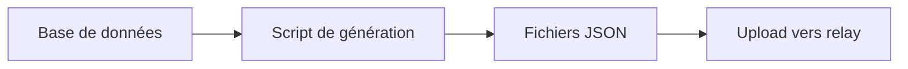
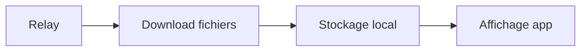

# Web Service Relay - Guide d'utilisation

## 🎯 Vue d'ensemble

Le Web Service Relay permet de synchroniser les fichiers JSON entre votre base de données côté client et votre application Flutter. Il offre :

- **Upload/Download** de fichiers JSON par société
- **Notifications temps réel** via WebSocket
- **Gestion organisée** des données par société
- **API REST** complète pour la synchronisation

## 🚀 Démarrage rapide

### 1. Démarrer le serveur

```bash
# Installer les dépendances
pip install fastapi uvicorn websockets requests

# Démarrer le serveur
python server.py
```

Le serveur sera accessible sur `http://localhost:8000`

### 2. Tester le relay

```bash
# Tester le client
python test_relay_client.py

# Générer des données de test
python client_generator.py
```

## 📡 Endpoints disponibles

### API REST

| Endpoint | Méthode | Description |
|----------|---------|-------------|
| `/api/files/societes` | GET | Liste des sociétés |
| `/api/files/societe/{societe}/files` | GET | Fichiers d'une société |
| `/api/files/download/{societe}/{filename}` | GET | Télécharger un fichier |
| `/api/files/upload/{societe}` | POST | Upload un fichier |
| `/api/files/sync/{societe}` | POST | Synchroniser une société |
| `/api/files/delete/{societe}/{filename}` | DELETE | Supprimer un fichier |
| `/api/files/status` | GET | Statut du relay |

### WebSocket

| Endpoint | Description |
|----------|-------------|
| `/api/files/ws` | Notifications temps réel |

## 🔧 Utilisation côté client

### 1. Script de génération de données

Votre script côté client peut générer les fichiers JSON et les envoyer :

```python
import requests
import json

# Configuration
RELAY_URL = "http://localhost:8000"
SOCIETE = "votre-societe"

def upload_json_file(societe: str, file_path: str):
    """Upload un fichier JSON vers le relay"""
    with open(file_path, 'rb') as f:
        files = {'file': (os.path.basename(file_path), f, 'application/json')}
        response = requests.post(f"{RELAY_URL}/api/files/upload/{societe}", files=files)
        return response.json()

# Exemple d'utilisation
upload_json_file("rsp-bgs", "comptes_2023.json")
```

### 2. Écoute des notifications WebSocket

```python
import asyncio
import websockets
import json

async def listen_notifications():
    """Écouter les notifications temps réel"""
    uri = "ws://localhost:8000/api/files/ws"
    async with websockets.connect(uri) as websocket:
        async for message in websocket:
            data = json.loads(message)
            print(f"Notification: {data}")

# Démarrer l'écoute
asyncio.run(listen_notifications())
```

## 📱 Intégration Flutter

### 1. Service de synchronisation

```dart
import 'dart:convert';
import 'package:http/http.dart' as http;
import 'package:web_socket_channel/web_socket_channel.dart';

class RelayService {
  static const String baseUrl = 'http://localhost:8000';
  static const String wsUrl = 'ws://localhost:8000/api/files/ws';
  
  // Récupérer les sociétés
  Future<List<String>> getSocietes() async {
    final response = await http.get(Uri.parse('$baseUrl/api/files/societes'));
    final data = json.decode(response.body);
    return List<String>.from(data['societes']);
  }
  
  // Télécharger un fichier
  Future<Map<String, dynamic>> downloadFile(String societe, String filename) async {
    final response = await http.get(
      Uri.parse('$baseUrl/api/files/download/$societe/$filename')
    );
    return json.decode(response.body);
  }
  
  // Écouter les notifications
  Stream<Map<String, dynamic>> listenNotifications() {
    final channel = WebSocketChannel.connect(Uri.parse(wsUrl));
    return channel.stream.map((data) => json.decode(data));
  }
}
```

### 2. Widget de synchronisation

```dart
class SyncWidget extends StatefulWidget {
  @override
  _SyncWidgetState createState() => _SyncWidgetState();
}

class _SyncWidgetState extends State<SyncWidget> {
  final RelayService _relayService = RelayService();
  List<String> _societes = [];
  
  @override
  void initState() {
    super.initState();
    _loadSocietes();
    _listenNotifications();
  }
  
  Future<void> _loadSocietes() async {
    final societes = await _relayService.getSocietes();
    setState(() {
      _societes = societes;
    });
  }
  
  void _listenNotifications() {
    _relayService.listenNotifications().listen((notification) {
      // Traiter les notifications
      print('Notification reçue: $notification');
    });
  }
  
  @override
  Widget build(BuildContext context) {
    return ListView.builder(
      itemCount: _societes.length,
      itemBuilder: (context, index) {
        return ListTile(
          title: Text(_societes[index]),
          onTap: () => _syncSociete(_societes[index]),
        );
      },
    );
  }
  
  Future<void> _syncSociete(String societe) async {
    // Synchroniser la société
    // Implémenter la logique de synchronisation
  }
}
```

## 📁 Structure des fichiers

```
payloads_societes/
├── rsp-bgs/
│   ├── comptes_global_annee_2023.json
│   ├── comptes_mensuel_2023_01.json
│   ├── indicateurs_global_annee_2023.json
│   └── ...
├── rsp-neg/
│   ├── comptes_global_annee_2023.json
│   └── ...
└── rsp-sb/
    ├── comptes_global_annee_2023.json
    └── ...
```

## 🔄 Flux de synchronisation

### 1. Côté client (génération)


### 2. Côté Flutter (consommation)


## 🚨 Notifications WebSocket

Le relay envoie des notifications pour :

- `file_uploaded` : Nouveau fichier uploadé
- `file_deleted` : Fichier supprimé
- `sync_completed` : Synchronisation terminée
- `connection` : Connexion établie

Exemple de notification :
```json
{
  "type": "file_uploaded",
  "societe": "rsp-bgs",
  "filename": "comptes_2023.json",
  "timestamp": "2023-12-19T10:30:00"
}
```

## 🔧 Configuration avancée

### Variables d'environnement

```bash
# Port du serveur
RELAY_PORT=8000

# Répertoire des fichiers
BASE_FILES_DIR=payloads_societes

# CORS origins
ALLOWED_ORIGINS=http://localhost:3000,https://votre-app.com
```

### Sécurité

- Ajoutez une authentification si nécessaire
- Limitez les types de fichiers acceptés
- Validez les données JSON avant sauvegarde

## 📊 Monitoring

### Statut du relay

```bash
curl http://localhost:8000/api/files/status
```

Réponse :
```json
{
  "status": "ready",
  "societes_count": 3,
  "total_files": 45,
  "websocket_connections": 2,
  "last_update": "2023-12-19T10:30:00"
}
```

## 🐛 Dépannage

### Problèmes courants

1. **Serveur non accessible**
   - Vérifiez que le serveur est démarré
   - Vérifiez le port (8000 par défaut)

2. **Erreur CORS**
   - Configurez les origines autorisées
   - Vérifiez les headers

3. **Fichiers non trouvés**
   - Vérifiez la structure des dossiers
   - Vérifiez les permissions

4. **WebSocket déconnecté**
   - Implémentez une reconnexion automatique
   - Vérifiez la stabilité réseau

## 📞 Support

Pour toute question ou problème :

1. Vérifiez les logs du serveur
2. Testez avec les scripts fournis
3. Consultez la documentation de l'API sur `/docs`

---

**Note** : Ce relay est conçu pour une utilisation en développement et test. Pour la production, ajoutez les mesures de sécurité appropriées. 